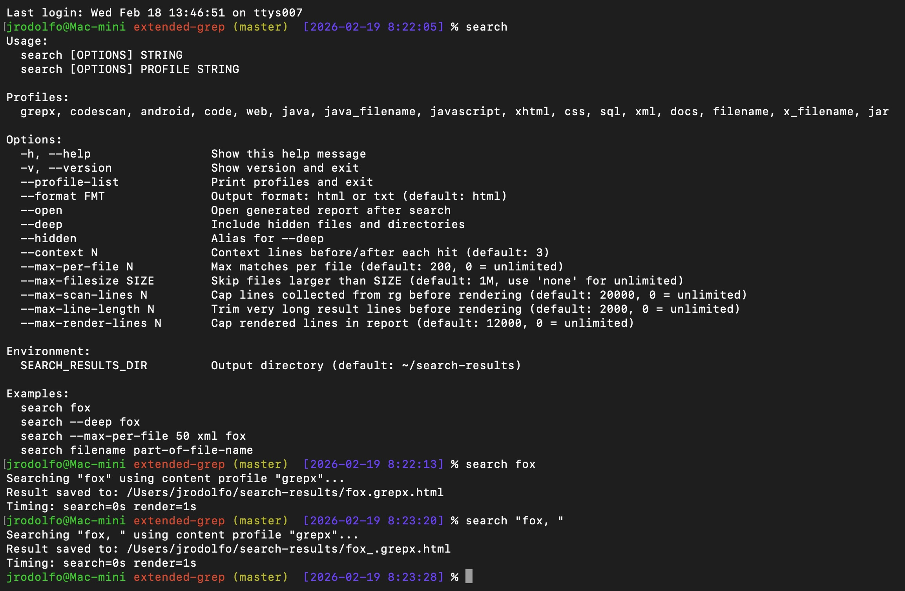
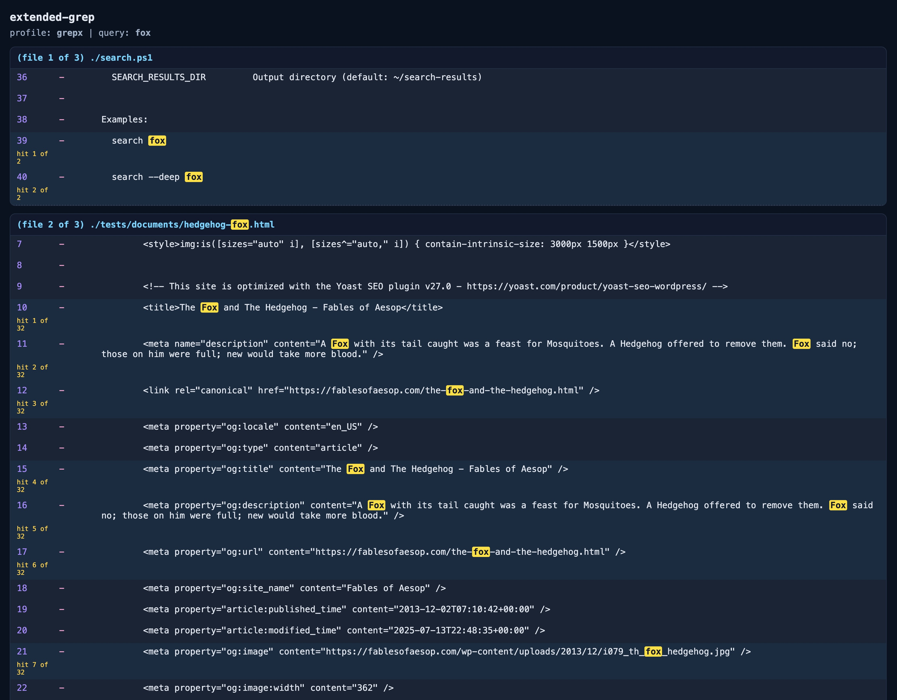

# extended-grep

`extended-grep` is a wrapper around `rg` (ripgrep) that saves search results as HTML files in `~/search-results`.

## Why use extended-grep

- Better handling for tricky search strings in day-to-day usage (for example: `search "fox, "`).
- Search results are written to HTML reports, so your terminal stays clean even for large searches.

Example:

```bash
search "fox, "
```

This creates an HTML report in `~/search-results`.

## Visual Example

Command usage:



Search result for `search fox`:



Search result for `search "fox, "`:


## Features

- Recursive project search with profiles (`grepx`, `code`, `xml`, `filename`, etc.)
- Colorized HTML output per search for faster visual scanning
- Works on macOS, Linux, and Windows

## Prerequisites

- ripgrep (`rg`) installed and available on `PATH`

macOS:

```bash
brew install ripgrep
```

Windows (PowerShell):

```powershell
winget install BurntSushi.ripgrep.MSVC
```

Linux:

```bash
# Amazon Linux / Fedora / RHEL (dnf)
sudo dnf install -y ripgrep

# Ubuntu / Debian (apt)
sudo apt-get update && sudo apt-get install -y ripgrep
```

## Install on macOS

1. Clone this repository.
2. Run:

```bash
./install-macos.sh
```

3. Open a new terminal and run:

```bash
search a-string
```

## Install on Linux

1. Clone this repository.
2. Run:

```bash
./install-linux.sh
```

3. Open a new terminal and run:

```bash
search a-string
```

## Install on Windows (PowerShell)

1. Clone this repository.
2. Run in PowerShell:

```powershell
./install-windows.ps1
```

3. If script execution is blocked, run once (current user):

```powershell
Set-ExecutionPolicy -Scope CurrentUser RemoteSigned
```

4. Open a new PowerShell window and run:

```powershell
search a-string
```

## Usage

```bash
search
search [OPTIONS] STRING
search [OPTIONS] PROFILE STRING
```

Running `search` with no arguments prints the help with all options.

Profiles:

- `grepx` (default)
- `codescan`
- `android`
- `code`
- `web`
- `java`
- `java_filename`
- `javascript`
- `xhtml`
- `css`
- `sql`
- `xml`
- `docs`
- `filename`
- `x_filename`
- `jar`

Examples:

```bash
search a-string
search --profile-list
search --version
search --deep a-string
search --max-per-file 50 a-string
search xml another-string
search filename part-of-file-name
```

Options:

- `--version`: print version and exit
- `--profile-list`: print available profiles and exit
- `--open`: open the generated HTML report after search
- `--deep` or `--hidden`: include hidden files/directories (slower)
- `--context N`: context lines before/after each hit (default `3`)
- `--max-per-file N`: limit matches per file (default `200`, `0` disables limit)
- `--max-filesize SIZE`: skip files larger than `SIZE` (default `1M`, use `none` to disable)
- `--max-scan-lines N`: cap lines collected from `rg` before rendering (default `20000`, `0` disables cap)
- `--max-line-length N`: trim very long result lines before rendering (default `2000`, `0` disables trimming)
- `--max-render-lines N`: cap rendered HTML lines (default `12000`, `0` disables cap)

Each run creates an HTML file in `~/search-results`.

Optional override:

- Set `SEARCH_RESULTS_DIR` to write results to a custom directory.
- Set `SEARCH_CONFIG_FILE` to point to a custom profile/default config file.

Shared config:

- Profiles and default limits are centralized in `config/search-profiles.conf`.
- Both `search.sh` and `search.ps1` read this file to avoid config drift.

## Notes

- The generated HTML is plain and portable (no browser plugins required).
- File naming is sanitized for cross-platform compatibility.
- You can still run scripts directly from the repo:

macOS/Linux shell:

```bash
./search.sh STRING
./search.sh PROFILE STRING
```

Windows PowerShell:

```powershell
./search.ps1 STRING
./search.ps1 PROFILE STRING
```

## Smoke Tests

macOS / bash:

```bash
bash ./tests/smoke.tests.sh
```

Linux / bash:

```bash
bash ./tests/smoke.tests.linux.sh
```

Windows PowerShell:

```powershell
Invoke-Pester ./tests/smoke.tests.ps1
```

Make targets:

```bash
make
make help
make test-mac
make test-linux
make test-ps
make test
make run ARGS="fox"
```

- `make` / `make help`: list available targets
- `make run ARGS="..."`: run `search.sh` with custom arguments

Windows note:

- The `make` commands above require `make` to be installed.
- Run the install commands from **PowerShell**.
- Option 1 (Scoop, recommended):

```powershell
Set-ExecutionPolicy RemoteSigned -Scope CurrentUser
irm get.scoop.sh | iex
scoop install make
```

- Option 2 (winget standalone make):

```powershell
winget install GnuWin32.Make
```

- Option 3 (Git Bash, which also includes `make` in many setups):

```powershell
winget install Git.Git
```

- After installing, close and reopen PowerShell before running `make`.

## CI

- GitHub Actions runs smoke tests on every push and pull request:
  - Linux: `make test-linux`
  - macOS: `make test-mac`
  - Windows: `Invoke-Pester ./tests/smoke.tests.ps1`

## Qodana Code Quality

Qodana is JetBrains' static analysis tool. In this project, it helps detect code quality problems early (for example, script issues, suspicious patterns, and maintainability problems) before they reach production.

Project files:

- `qodana.yaml`: Qodana configuration (profile, linter image, analysis options)
- `.github/workflows/qodana_code_quality.yml`: GitHub Actions workflow for automated Qodana scans
- `how-do-i-install-qodana.md`: installation instructions for Windows and macOS
- `how-do-i-run-qodana-on-this-project.md`: step-by-step local and CI usage notes

Run locally:

```bash
qodana scan --show-report
```

Run in GitHub:

- The Qodana workflow runs on push to `master`, on pull requests, and via manual trigger (`workflow_dispatch`).
- To publish cloud/PR results, add `QODANA_TOKEN` in repository secrets.
